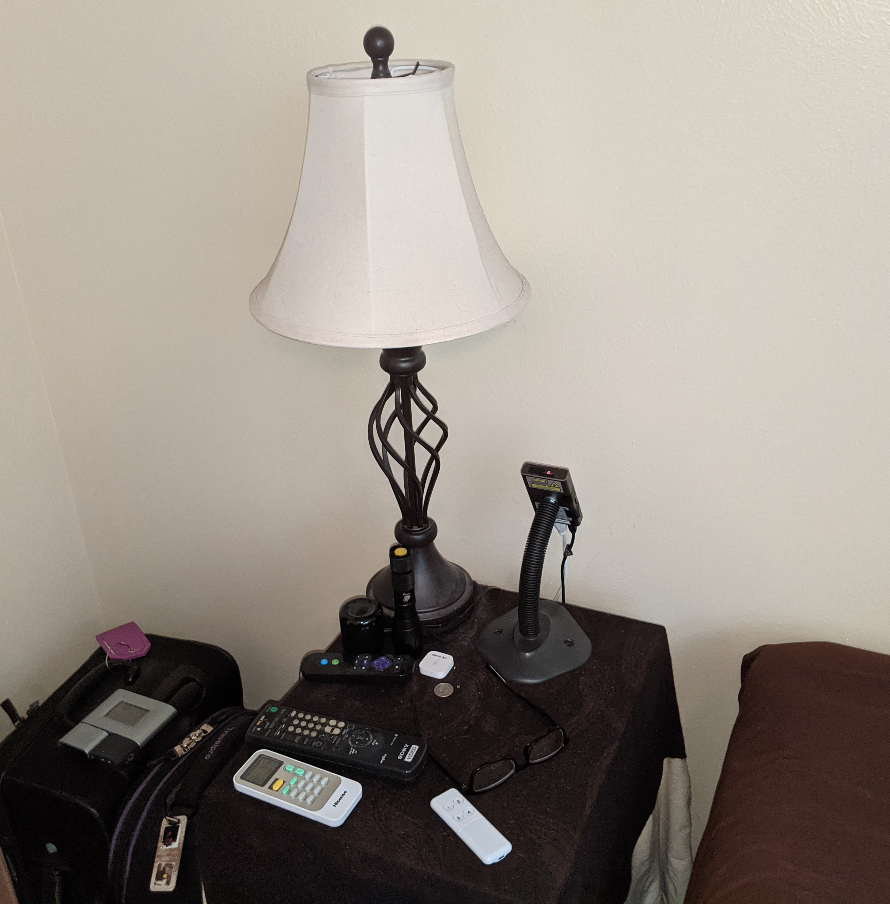

# rpi-ha-ceiling-display

This repo contains Python code to display select Home Assistant data on bedroom ceiling.  It uses the [Pygame](https://www.pygame.org/wiki/about)] library to create the framebuffer / image that is output to the HDMI interface. The display image is very simple, initialized at 1280 x 720 resolution to match AnyBeam native resolution and contains just a few lines of text. 

The colon seperating the hours and minutes toggle every 1/2 second which gives an indicator that the display is updating propertly.

The "Events" and other fields below it are just debug fields to indicate Home Assistant connection and event traffic.

See [Notes about using Raspberry Pi 4b](notes/notes.md)

The following is the Amazon review of the [AnyBeam projector](https://amzn.to/38EXRTJ). I added it here as it does a good job describing this project.

# AnyBeam Review

No other projector that I have found can do what this projector can do.  For my use-case (project) this is the perfect projector.  The key features for me were "true black" via the MEMS laser and it's fanless design.  My use-case is unique and I'll explain how I use this projector below.

Note: This projector does NOT work well with with Raspberry Pi 4b (for 8+ hours). It seems the RPi4b's HDMI timing is a bit glitchy every once in a while which causes the AnyBeam to lockup with a frozen image of whatever was displayed at the time of the glitch.  This occurs within 8 hours of continuous display.  I exchanged emails with AnyBeam support and they are aware of the issue but the issue seems to be on the RPi4b side.  I would be nice if the AnyBeam firmware was able to recover from this issue -- maybe an AnyBeam firmware update at some point.  Hopefully a future RPi4b update will fix the glitchy HDMI output.

## Project Background

I have an old Radio Shack atomic clock in my bedroom that projects the time onto the ceiling.  This has been fantastic and still works great.  However I wanted to display additional information onto the ceiling such as outside temperature, inside temperature, wind speed, thermostat setting, in addition to the current time.  The additional information I want to display is available vi [Home Assistant](https://www.home-assistant.io/) .  Home Assistant is a very powerful open-source home automation software.  The problem is how to get this information to display onto the ceiling of the bedroom.  

The natural solution is some type of projector connected to a Raspberry Pi or a micro x86 PC.  The good news is that brightness (high lums) is not something I need as the bedroom in pitch black at night and does not need much brightness to display readable text.  In fact it needs to be very dim as to not be disturbing at night while sleeping. The problem is finding a projector that does not use a technology that "blocks" the light to achieve black.   Projector technologies like LCD and DLP work by projecting a very bright light through a filter that "blocks" the colors it doesn't want to display.  The challenge is blocking all light from a very bright light in order to produce black is not perfect.  So black is really shown as dark gray.  This is often called "picture-frame" as the entire display is illuminated and the edges of the projected display are visible even if the image is intended to be black.  

The secondary issue with finding a workable projector is finding something that is fanless.  Since the projector will be located on my nightstand which sits near my head, having a projector with a fan that producing noise when trying to sleep is a non-starter.  Not to mention that tiny fans are prone to fail and since this will be running 8+ hours a night, fanless is a requirement.

AnyBeam projector to the rescue!  

## Project Result

The AnyBeam projector is connected to a Dell Optiplex 3020M via HDMI via a DisplayPort adapter.  I started with a Raspberry Pi 4b but had to change because of issue described above.  Fortunately the mini PC is running at 1% CPU utilization so the fan never comes on.  The PC is running Linux and some custom Python code.  The Python code connects to Home Assistant and renders text onto a screen which is projected into the ceiling.  Since this new ceiling display is replacing the old Radio Shack Atomic clock ceiling display, I also have ntp running to keep the projected time accurate.  Through code I adjust the color brightness down to 15% to make it very dim which is perfect for sleeping. The great thing is that I can change the color brightness during the day and project perfectly readable text onto the ceiling during the day -- think nap time.    :)

I did find that under complete black room conditions that the AnyBeam projector was showing a thin white line at the bottom right of the projected image.  It seemed to be under the 720th line of resolution of the display.  The easy fix was putting black electrical tape on the bottom of the lens such that it blocked the unwanted thin white line but doesn't block (much of) the bottom of the display.

## Mount
The following images show how the AnyBeam is mounted on a gooseneck to aim the projector on the ceiling of bedroom.  The AnyBeam projector has a 1/4-20 mount so it's easy to attach to various stands.

## Example Display output

