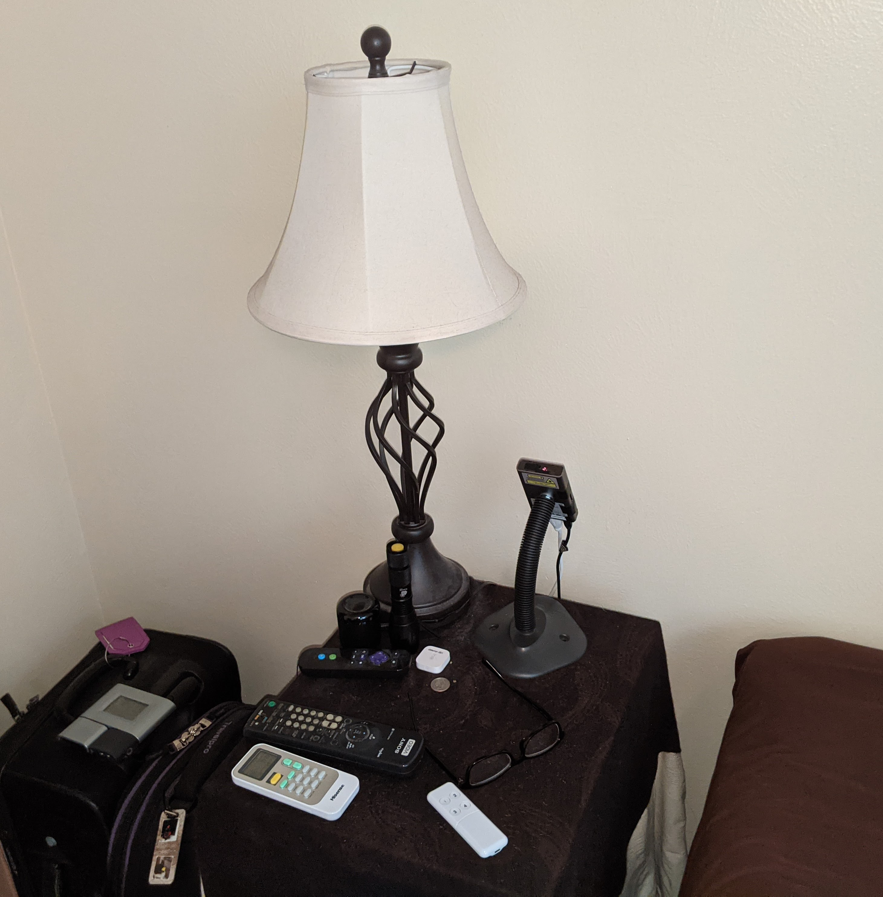
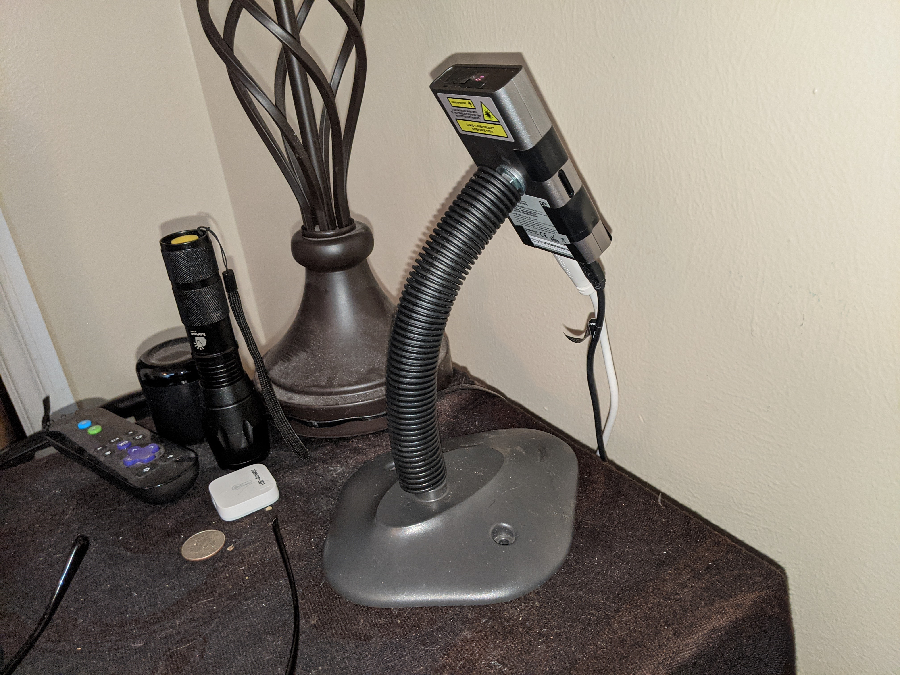
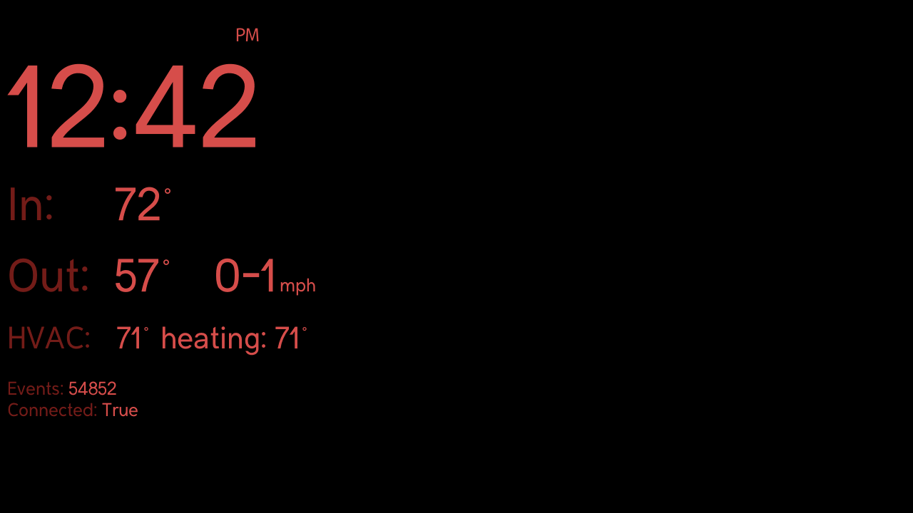
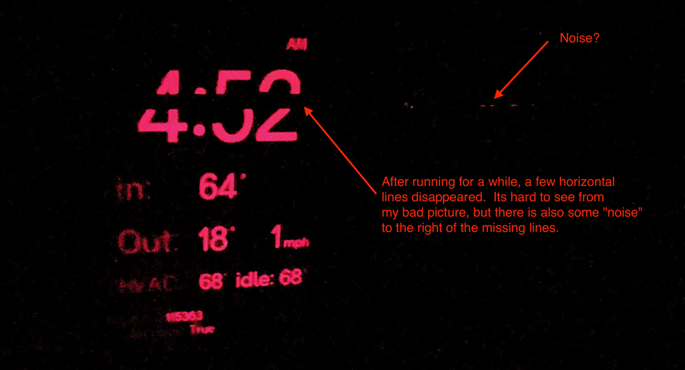
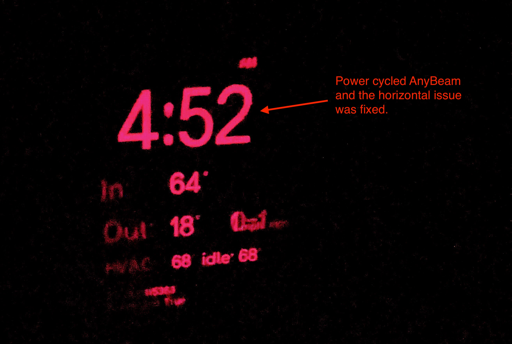

# Intro

The following are my notes to date regarding the AnyBeam projector.

# Background

I have a atomic clock that projects the time on the ceiling of by bedroom so you can easily see what time it is in the middle of the night.  However I wanted additional information displayed such as outside temperature, wind speed, inside temperature, thermostat settings.  I have all this information available via [Home Assistant](https://www.home-assistant.io/) (home automation software).  The plan is to use a raspberry Pi to generate a display that will be output via HDMI and then displayed via a projector on the ceiling of the bedroom.

The problem is finding a small fanless projector where the "black" is truly black.  Since this is to be viewed at night, the inensity of the display was not important (low Lux was just fine).  This where the [AnyBeam Pico Mini Portable Pocket Projector](https://www.amazon.com/gp/product/B088BG59QR/) comes into the picture.  It looked perfect for my needs.  With the MEMS laser configuration, it was low power, no fan, black was black, it was small.  I was worried about having it powered on 8-12 hours per night but I wasked AnyBeam who said that it would be fine.

I puchased the AnyBeam Pico Mini Portable Pocket Projector on 11/23/2020.

# Setup

The following images show how the AnyBeam is mounted on a gooseneck to aim the projector on the ceiling of bedroom.

# Software
This repo contains the Python code that runs on Linux on the Rasepberry Pi. It uses the [Pygame](https://www.pygame.org/wiki/about)] library to create the framebuffer / image that is output to the HDMI interface. The display image is very simple, initialized at 1280 x 720 resolution to match AnyBeam native resolution and contains just a few lines of text. This is an example of what the display shows:

The colon seperating the hours and minutes toggle every 1/2 second which gives an indicator that the display is updating propertly.

The "Events" and "Connected" fields are just debug fields to indicate Home Assistant connection and event traffic.

# Issues

I have encountered the following issues while using the AnyBeam projector.

## Display freezes

As often as 3 times per night (12 hour period), the display will freeze.  What I mean is the projected image that contains the time, is no longer updated and shows a frozen-in-time display.  Two ways to fix the issue:
1. Power cycling the AnyBeam projector (remove / restore the USB power).
2. Pull the HDMI cable and re-attach

I verified that the image is still updated from the Raspberry Pi by viewing its raw framebuffer via a ssh.  I also attached the HDMI cable from Raspberry Pi to an LCD dislay and everything was updating.  

This issue is a show stopper as you can't have a time display that randomly freezes which results in showing a time that is no longer accurate.  Any AnyBeam firmware update fixe this??  I'm hoping so.

## White horizonal line

A white horizontal line (about 5-10 pixels high) shows on top of content.  These white lines flicker so its not solid.  This has happened twice over 4 days.  Power cycling AnyBeam fixed.  I forgot to take a picture of the issue.

## Black horizonal line

A black horizontal line (about 5-10 pixels high) shows on top of content.  This has happened 3 times over 4 days.  Power cycling AnyBeam fixed.

Picture of issue (ignore the bad photo quality)

Picture after power cycle of AnyBeamn (ignore the bad photo quality)

## Occasional flash

Occasional flash for less then a second of something white (bright) - Notice it maybe once per night. Maybe its losing HDMI signal for a faction of a second?

## Lost HDMI signal for a few seconds

Lost signal in middle of night and showed the connect Anybeam screen for 4 seconds or so.  It auto-reconnected.

TOOD: Image

## Buzzing sound

Twice over 4 days I heard a buzzing type noise come from Anybeam (I don't think it was from the speaker).  Lasted only a few seconds.  It's a low volume buzz but since it's next to my bed in a quiet room, I noticed it

## Very faint bottom line

There is a very faint white (gray?) line at the bottom of the display -- seems to be after the 720th row of the display.  After adjusting many setting in software with no fix, I just put some black electrical tape on the very bottom of the lens.  This masked off the line.  No a big deal and it was an easy workaround.

